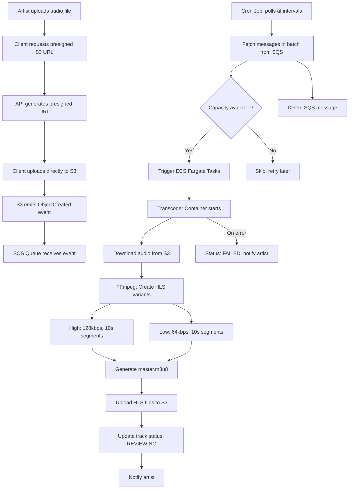
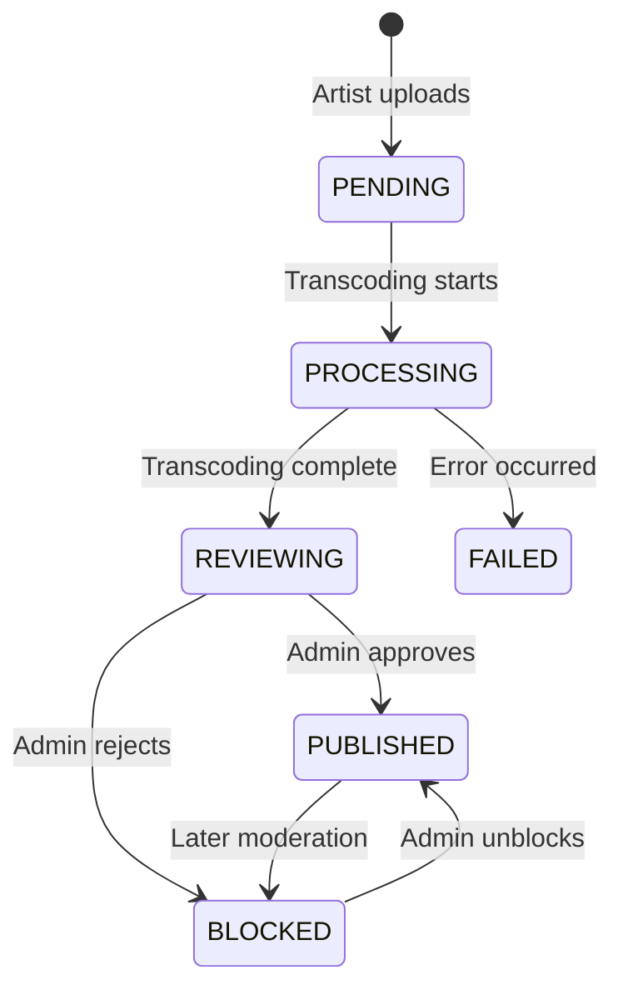
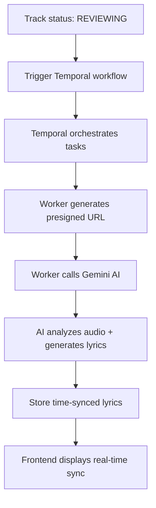
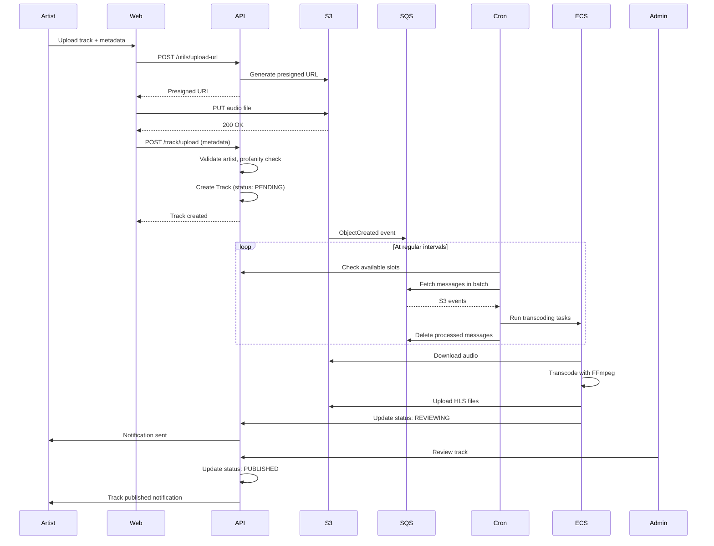
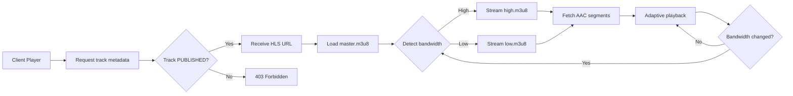
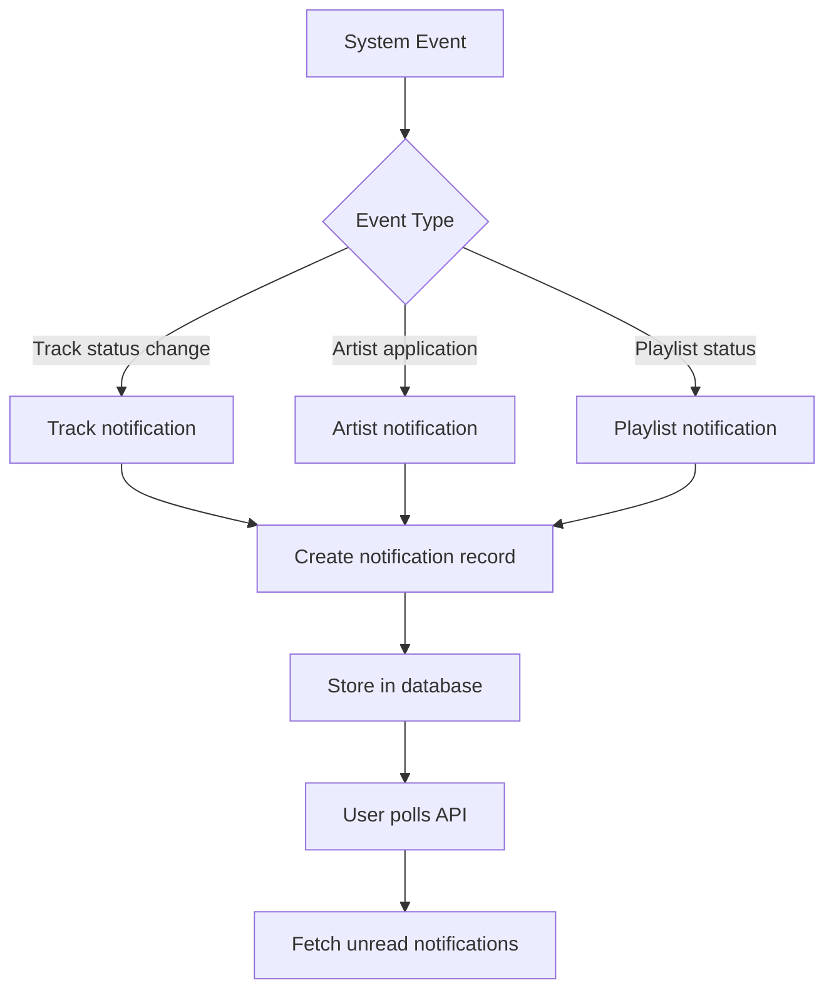

# Mizzo Platform Architecture

This document describes the backend architecture for the Mizzo music streaming platform, focusing on audio transcoding, track upload and publishing, AI-powered live lyrics generation, audio streaming, and notification system.

---

## 1. Audio Transcoding Architecture

### Flow (upload to HLS streaming)



### Transcoding Details

#### Step 1: Presigned Upload

- Artist requests upload URL from API (`POST /utils/upload-url`)
- API generates S3 presigned URL (15 min expiry) for `raw-track/{trackId}.mp3`
- Client uploads directly to S3, bypassing API for large files

#### Step 2: Event Triggering

- S3 emits `ObjectCreated` event when upload completes
- Event sent to SQS queue for reliable processing
- Decouples upload from processing

#### Step 3: Scheduled Processing

- Cron service polls SQS at regular intervals
- Fetches messages in batch based on available capacity
- Creates ECS Fargate tasks for available capacity
- Auto-retry on failure with visibility timeout and retry limits

#### Step 4: Transcoding

- ECS spawns isolated Docker container with FFmpeg
- Downloads original audio from S3
- Creates two HLS variants:
  - _High quality_: 128kbps AAC, 10-second segments
  - _Low quality_: 64kbps AAC, 10-second segments
- Generates `master.m3u8` playlist pointing to quality variants

#### Step 5: Delivery

- Uploads all `.m3u8` playlists and `.aac` segments to S3
- Updates track status in database (`REVIEWING`)
- Container cleans up and terminates
- Artist notified via notification system

### S3 Directory Structure

```sh
s3://bucket/
├── raw-track/
│   └── {trackId}.mp3          # Original upload
└── transcoded-track/
    └── {trackId}/
        ├── master.m3u8         # Master playlist
        ├── high.m3u8          # High quality playlist
        ├── high_000.aac       # High quality segments
        ├── high_001.aac
        ├── low.m3u8           # Low quality playlist
        ├── low_000.aac        # Low quality segments
        └── low_001.aac
```

### Track Status Lifecycle



---

## 2. AI-Powered Live Lyrics System

### Flow (transcoding completion to live lyrics)



### Live Lyrics Generation Details

#### Step 1: Workflow Trigger

- API detects track status change to `REVIEWING`
- Triggers Temporal workflow with track metadata
- Creates workflow record with `PENDING` status

#### Step 2: Temporal Orchestration

- Temporal Cloud manages distributed task execution
- Executes activities: audio URL generation, AI processing, database updates
- Automatic retry with exponential backoff on failure

#### Step 3: AI Processing

- Worker calls Gemini 3 Flash Preview via Vercel AI SDK
- Analyzes audio from presigned S3 URL + track metadata
- Generates time-synchronized lyrics with millisecond precision

#### Step 4: Result Storage

- Worker stores generated lyrics in database
- Updates workflow status to `COMPLETED` or `FAILED`
- Triggers notifications for completed processing

---

## 3. Track Upload and Publishing Flow

### Complete Upload Flow



### Upload Process Details

#### 1. Client-Side Upload

- Artist fills form: title, language, duration, tags, lyrics, poster image
- Profanity check on all text inputs
- Request presigned URLs for both audio file and poster image
- Upload files directly to S3 (parallel uploads)

#### 2. Track Registration

```typescript
POST /track/upload
{
  id: "cuid",
  title: "Track Name",
  language: "english",
  duration: 180,
  tags: ["rock", "indie"],
  posterUrl: "s3://bucket/poster/id.jpg",
  trackUrl: "s3://bucket/raw-track/id.mp3",
  secondaryArtistIds: ["artist2", "artist3"]
}
```

#### 3. Validation

- Verify artist authentication
- Check S3 URL formats
- Validate secondary artists exist and have artist role
- Profanity detection on title, tags
- Create Track record with status `PENDING`

#### 4. Admin Review

- Admin views tracks with `REVIEWING` status
- Can update metadata (title, tags, lyrics)
- Approve → `PUBLISHED` (track goes live)
- Reject → `BLOCKED` (track hidden)
- Notifications sent to artist on status change

---

## 4. Audio Streaming

### HLS Adaptive Streaming



#### How HLS Works

1. Player requests master playlist from S3/CloudFront
2. Master playlist lists available quality variants
3. Player measures bandwidth, selects appropriate quality
4. Loads quality-specific playlist (high.m3u8 or low.m3u8)
5. Sequentially fetches audio segments (.aac files)
6. Monitors bandwidth, switches quality as needed
7. Seamless quality transitions without interruption

#### Fallback: Byte-Range Streaming

- For players without HLS support
- API endpoint: `GET /stream/{trackId}`
- Requires `Range` header (e.g., `bytes=0-1048575`)
- Returns 206 Partial Content
- Progressive loading of original MP3 file

---

## 5. Notification System

### Notification Flow



#### Notification Types

- Track: `REVIEWING`, `PUBLISHED`, `BLOCKED`
- Artist Application: `APPROVED`, `REJECTED`
- Playlist: `PUBLISHED`, `BLOCKED`, `REVIEWING`

#### Client Interaction

- `GET /notification`: Fetch unread notifications
- `PUT /notification/{id}`: Mark as read or delete
- Polling-based (upgradeable to WebSocket for real-time)

---
