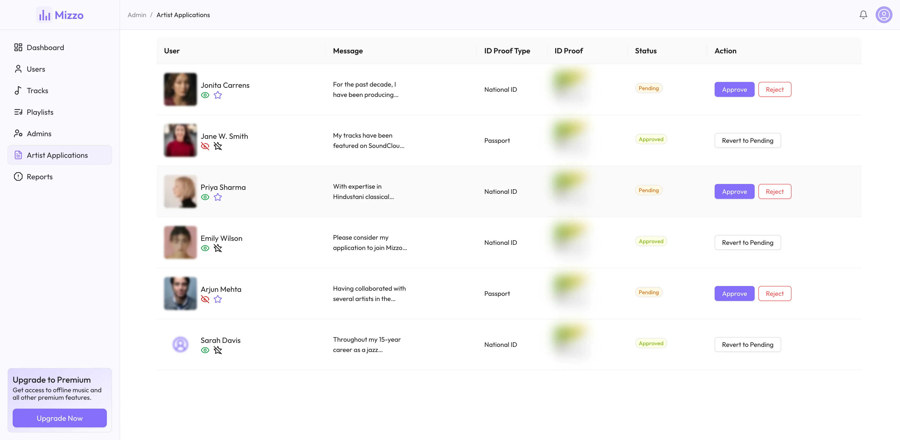

    

    <h1>Mizzo</h1>
    
Where music flows

    
    
    

 

## ⚡ Introduction

Mizzo is a music streaming platform that allows users to discover, play, and share their favorite music. With features for listeners, artists, and administrators, Mizzo provides a comprehensive ecosystem for music enthusiasts, offering high-quality streaming, personalized playlists, artist tools, and robust platform management all in one place.

## ✨ Features

- Stream music with adaptive bitrate streaming (HLS) for optimal quality
- Manage user profile with customizable fields and integrations
- Secure user authentication and authorization with Role-based access control
- Create, share, and manage personal playlists
- Full text search for tracks, artists, and playlists
- View track lyrics and metadata with a fully-featured, HLS audio player
- Like, collect favorite content, and listening history
- Upload, manage, curate, and share tracks as an artist
- Admin panel for managing users, artists, content quality and platform integrity
- Monitor analytics, statistics, and manage platform settings

## ⚙️ Tech Stack

- Next.js
- React.js
- Node.js
- Express.js
- TypeScript
- PostgreSQL
- TurboRepo
- AWS (Lambda, S3, SQS, ECS, SES)
- Tanstack Query
- Tailwind CSS
- Ant Design
- Prisma ORM
- Grafana Loki

## 📦 Other Libraries and Tools

- Docker
- Serverless Framework
- Redis
- FFmpeg
- NextAuth
- Node Cron
- ESLint
- Prettier
- Husky

## 🎯 Goals

- [x] Craft a TurboRepo-powered monorepo architecture to maximize code reuse and streamline development
- [x] Learn popular AWS services (i.e. S3, SQS, ECS, SES) and implement them in the project
- [x] Engineer a robust, containerized audio processing pipeline with FFmpeg, delivering HLS adaptive bitrate streaming
- [x] Create a seamless audio playback experience through an HLS-compatible player with adaptive quality switching
- [x] Enhance database performance with PostgreSQL full-text search and Prisma ORM optimizations
- [x] Secure user sessions with NextAuth's JWT-based authentication system
- [x] Boost API performance with Redis-powered caching for high-traffic endpoints
- [x] Orchestrate background tasks using AWS services in a microservice-oriented architecture
- [x] Implement notification system for user engagement and activity tracking

## 🏗️ Repository Structure

This monorepo contains multiple applications and shared packages, orchestrated with Turborepo for efficient builds and development workflows.

### Applications

- **[API](./apps/api/readme.md)**: Backend REST API service built with Express.js
- **[Web](./apps/web/readme.md)**: Frontend Next.js web application
- **[Cron](./apps/cron/readme.md)**: Scheduled task service for maintenance operations
- **[Transcoder](./apps/transcoder/readme.md)**: Media processing service using FFmpeg

### Packages

- **Prisma**: Database schema and client using Prisma ORM
- **AWS**: AWS SDK utilities and configurations
- **Redis**: Redis client and utilities
- **Logger**: Shared logging infrastructure
- **Utils**: Common utility functions
- **Typescript Config**: Shared TypeScript configurations
- **Eslint Config**: Shared ESLint configurations
- **Tailwind Config**: Shared Tailwind CSS configurations

### Database Schema

## 🖼️ Screenshots

## 👋🏻 Contact

